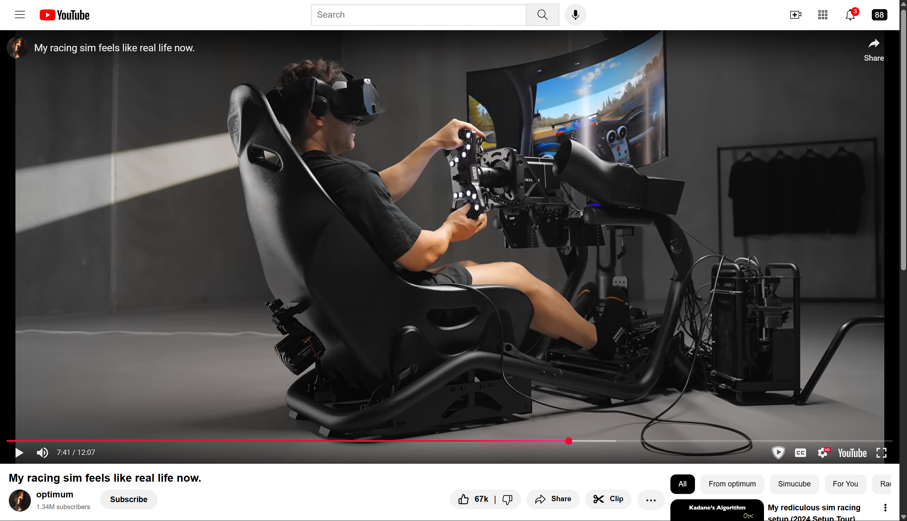

# YouTube Clone (HTML & CSS)

A static YouTube homepage clone built using HTML and CSS.

🔗 [Live Demo](https://bright-froyo-24bb95.netlify.app/)

## 💡 Purpose

The goal of this project was to:
- Practice HTML structure and semantic tags
- Learn modern CSS styling and layout techniques (especially Flexbox)
- Understand how real-world UI components are built

## Screenshots

### Home Page

### Video Preview Page

